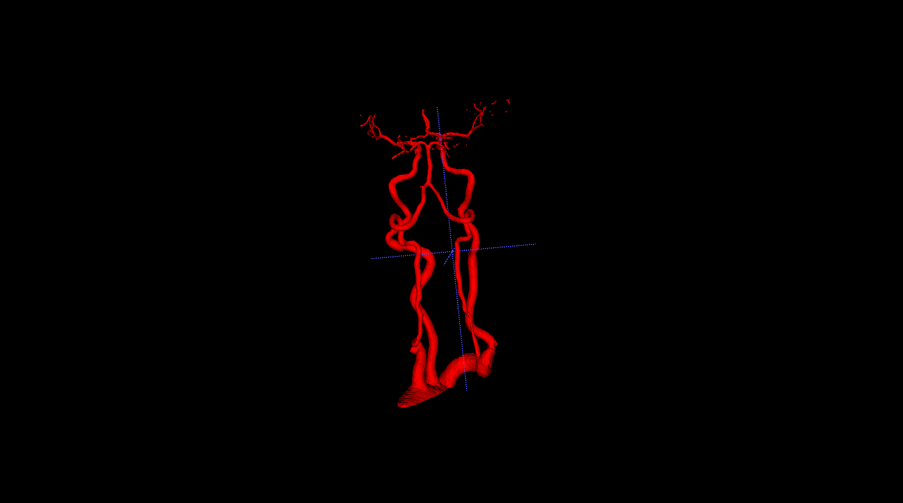

# 脑血管数据集

## 下载数据

需要下载序列、mask，并将mask进行重命名，执行如下代码：

run: `python download/download.py`

## 实验结果记录

模型推断执行：`train.py`中的`inference`

|experiment index|num_classes|base_n_filter|init lr|epochs|crop size|aug|init weights|train output|inference result|train mode|
|-|-|-|-|-|-|-|-|-|-|-|
|train.sh/exp1|2|6|2e-4|400|228 228 320|seg_train|common_seg_epoch_187_train_0.044|common_seg_epoch_278_train_0.035||model.eval()|

### 实验结果记录1

包含在训练集中的数据

测试集中的数据
