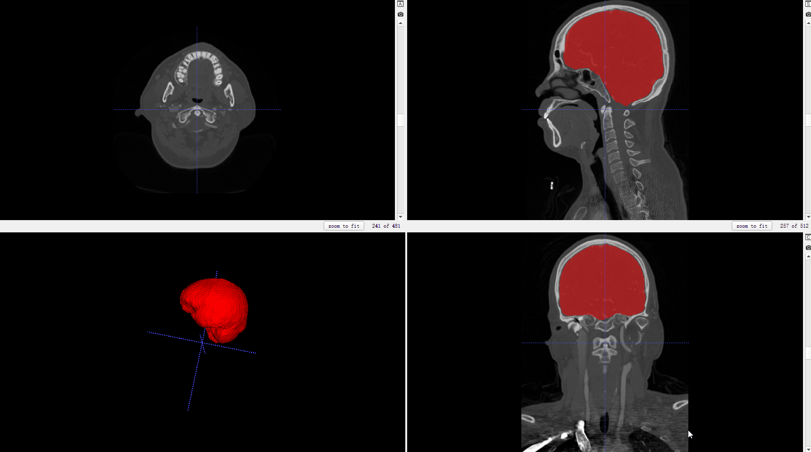

## 数据集

训练数据路径:`/data/medical/brain/cerebral_parenchyma/exp/ct_256`
训练过程中数据划分配置：`/data/medical/brain/cerebral_parenchyma/exp/ct_256/config`

生成过程:`./datasets/data_preprocessing.py`

## 训练

## 实验结果记录

模型推断执行：`train.py`中的`inference`

|experiment index|num_classes|base_n_filter|init lr|epochs|crop size|aug|init weights|train output|inference result|train mode|auto resize|
|-|-|-|-|-|-|-|-|-|-|-|-|
|train.sh/exp1|2|6|2e-4|400|256 256 256|seg_train|None|common_seg_epoch_278_train_0.035||model.eval()|True|

### 实验结果记录1

包含在训练集中的数据

测试集中的数据
