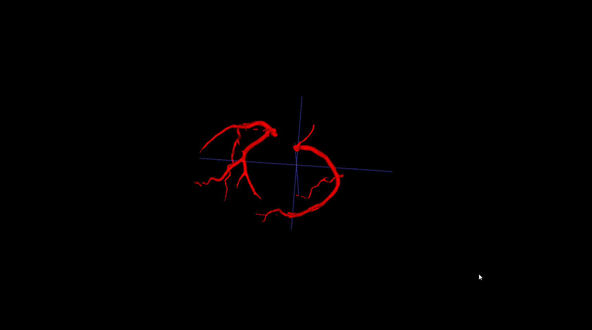

## 实验结果记录

模型推断执行：`train.py`中的`inference`

|experiment index|num_classes|base_n_filter|init lr|epochs|crop size|aug|init weights|train output|inference result|train mode|
|-|-|-|-|-|-|-|-|-|-|-|
|train.sh/exp1|2|6|2e-4|400|384 384 256|seg_train|common_seg_epoch_28_train_0.069|common_seg_epoch_46_train_0.060||model.eval()|

### 实验结果记录1

包含在训练集中的数据

测试集中的数据

