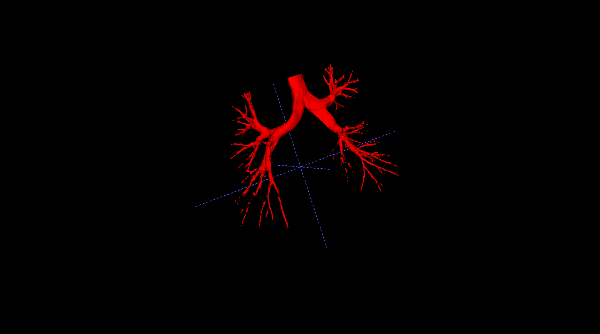
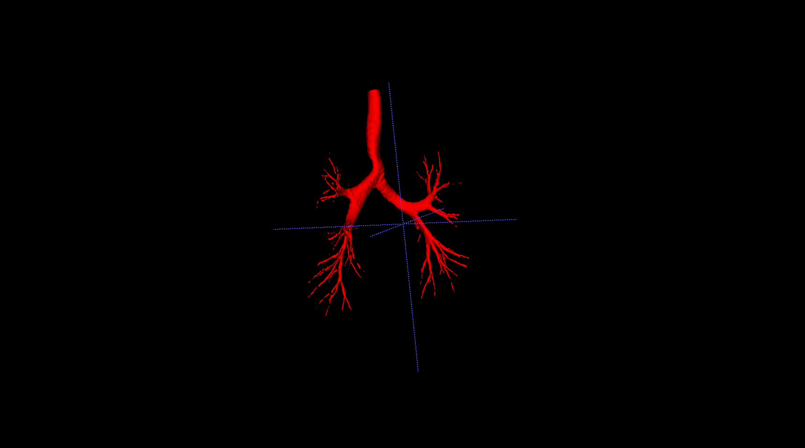

## 实验结果记录

模型推断执行：`train.py`中的`inference`

|experiment index|num_classes|base_n_filter|init lr|epochs|crop size|aug|init weights|train output|inference result|train mode|
|-|-|-|-|-|-|-|-|-|-|-|
|train.sh/exp1|2|6|2e-4|200|416 288 288|inference|common_seg_epoch_183_train_0.054|common_seg_epoch_128_train_0.052||model.eval()|
|train.sh/exp2|2|8|1e-3|400|384 256 288|inference|common_seg_epoch_157_train_0.060|common_seg_epoch_144_train_0.047||model.eval()|

### 实验结果记录1

包含在训练集中的数据

测试集中的数据

### 实验结果记录2

包含在训练集中的数据

测试集中的数据

